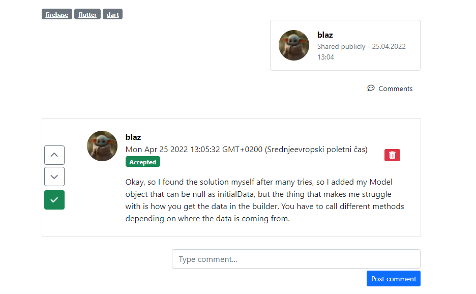

# Light Replica of StackOverflow

This project is a simple web app, similar to StackOverflow.

## Images
### Login page
&nbsp;&nbsp;&nbsp;&nbsp;
### Ask questions page
&nbsp;&nbsp;&nbsp;&nbsp;
### Show question page
&nbsp;&nbsp;&nbsp;&nbsp;
### Accept question
&nbsp;&nbsp;&nbsp;&nbsp;
### Home page

## Implemented functionality: 
- user authentication (sign up/sign in),
- user images,
- posting and deleting questions with title, description and tags,
- answering questions,
- commenting questions and answers,
- selecting answer as accepted.

## Technologies  
This application was developed in [PHP Storm](https://www.jetbrains.com/phpstorm/) using MongoDB, Express and NodeJS.   

## Author 👋
This app was developed by [Blaž Čerpnjak](https://github.com/blaz-cerpnjak), who is currently a student at Faculty of Electrical Engineering, Computer Science and Informatics, University of Maribor. 
This app was an exercise in one of the subjects.
